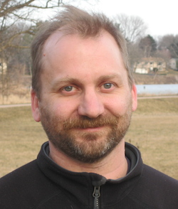

Kwame Forbes is a [post-bac scholar](https://www.med.unc.edu/oge/stad/prep/) at [UNC-CH](https://www.unc.edu) working in bioinformatics
with [Michael Love (UNC)](http://mikelove.github.io) on developing a feature in [DESeq2](https://bioconductor.org/packages/release/bioc/html/DESeq2.html) to integrate with single-cell datasets.

Kwame received an AS in [computer science](https://uvi.edu/academics/science-math/departments/computer-comp-sciences/assoc-science/default.aspx) and a BS [biology](https://uvi.edu/academics/science-math/departments/bio-sciences/biology-program/bach-science/default.aspx) with a 
[concentration in Computational Biology](https://uvi.edu/academics/science-math/departments/bio-sciences/biology-program/computational-biology/default.aspx) in 2019, from the [University of the Virgin Islands(UVI)](https://uvi.edu). During his time in undergraduate, he was a [RISE scholar](https://www.uvi.edu/research/emerging-caribbean-scientists-programs/programs1/mbrs-rise-research-scholars-program.aspx)who presented his research at [ABRCMS](https://www.abrcms.org) in 2018 and 2019. Along with research, Kwame was a teaching assistant for genetics and a lab instructor for intro to CompSci and for chemistry. 

Kwame is passionate about computer science, biology, and research. He is aiming to get his PhD in Computational Biology and Bioinformatics.

[github](https://github.com/KwameForbes) 
[Linkedin](https://www.linkedin.com/in/kwame-forbes-008451192/)  
he/him

---

<h4>Contact</h4>

    

        

            Kwame Forbes 
            <a href="http://sph.unc.edu/bios/biostatistics/">Department of Biostatistics</a> 
            <a href="https://www.unc.edu">The University of North Carolina&ndash;Chapel Hill</a> 
            <a href="https://www.google.com/maps/place/Bioinformatics+Building,+130+Mason+Farm+Rd,+Chapel+Hill,+NC+27514/@35.9027381,-79.0544156,17z/data=!4m13!1m7!3m6!1s0x89acc2faa0f3e2e9:0x931300e4c4f745d!2sBioinformatics+Building,+130+Mason+Farm+Rd,+Chapel+Hill,+NC+27514!3b1!8m2!3d35.9016909!4d-79.0532944!3m4!1s0x89acc2faa0f3e2e9:0x931300e4c4f745d!8m2!3d35.9016909!4d-79.0532944?hl=en">Bioinfomatics Building</a> 
            130 Mason Farm Rd 
    Chapel Hill, NC 27514 
            USA  

            Email: kwamek@email.unc.edu 
            Phone: 340-998-1733
            

        

        

        
        

    

